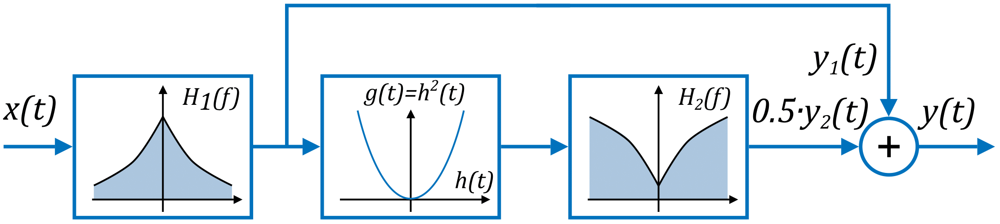

# Behavioral LED model in MATLAB

[]()


This GitHub repository contains a ready-to-use implementation of a behavioral model for Light Emitting Diode (LED) nonlinearity in MATLAB. The model is based on two filters and was detailed in the paper:

> Juliusz Bojarczuk, Michal Marzecki, Di Sun, Zuxin Jin, Pengfei Tian and Grzegorz Stepniak, "A Behavioral Model of the Light Emitting Diode Nonlinearity", under consideration for publication. []()

</br>

<details>
  <summary>See more details</summary>
In the abovementioned paper, we provided a detailed description of the behavior of LED diodes used in VLC. In our paper, we have presented a simple yet accurate model of LED nonlinearity, based on the use of two filters. We believe that its features make it applicable in modeling simple VLC links, as well as optimizing the operation of more complex systems. Therefore, a part of this work is also a ready-to-use implementation of the behavioral model in the MATLAB environment, which allows for a straightforward generation of a signal at the output of the modeled LED diode.

</br>

The proposed model as a block diagram:



In the model, the LED is represented as a two-arm parallel system. The H1 filter is designed as a low-pass filter, while H2 is a high-pass filter that is followed by a nonlinear operation.

The implementation of the model is available as an open repository on the GitHub platform. Additionally, the repository includes example measurement data, which was used to present some of the results in our paper.

By providing a publicly available function, we ensure that the presented model will be implemented by research groups in full accordance with its assumptions, thereby avoiding any potential mistakes or errors resulting from incorrect programmatic implementation of the behavioral model.

</details>

</br>

## Sample MATLAB Scripts (on how to use behavioral model in your code)

This repository contains three MATLAB scripts that serve as examples:
- [*TransmitThroughModel.m*](./Scripts/TransmitThroughModel.m)
- [*EyediagramForSampleData.m*](./Scripts/EyediagramForSampleData.m)
- [*PlotKernels.m*](./Scripts/PlotKernels.m)


### **TransmitThroughModel**


(1) Suppose that you have measured LED **3dB bandwidth** ($f_B$,*ledBandwidth3dB*) and is equal to **45 MHz**.\
(2) For the same frequency, you have generated sinusoidal signal with amplitude $I_a$ and measured fundamental harmonic power at the receiver as $P_{h1}(2\pi f_B)$. Electrical to optical conversion factor ($\eta$, *eta*) is equal to exactly $\frac{2\sqrt{P_{h1}(2\pi f_B)}}{I_a}$. For our case it will be 0.02.\
(3a) Next, you drive the LED again with harmonic signal with amplitude $I_a$ and frequency equal to $f_B$. However you calculate the power ratio of the second harmonic ($2f_B$) to fundamental one ($f_B$) at the receiver and treat this ratio as $P_{r1}$.\
(3b) We need the second measurement point for obtaining model parameters. Thus, you drive the LED with harmonic signal with amplitude $I_a$ and frequency equal to $\frac{1}{2} f_B$. Obtained power ratio of the second harmonic ($f_B$) to fundamental one ($frac{1}{2}f_B$) at the receiver is $P_{r2}$.\
(4) Nonlinearity factor $\Gamma$ is equal to exactly $\sqrt{\frac{160}{3 I_a^2 \eta^2} \left ( P_{r2}-P_{r1} \right)}$, while cutoff frequency of second filter $2\pi f_A$ is equal to $\sqrt{4\omega_B^2\frac{P_{r2}-P_{r1}}{4P_{r1}-P_{r2}}}$.[^1].

[^1]: Each parameter is described in detail in the main paper, and a brief overview can be found in the  [ledbehavioral.m](/Functions/ledbehavioral/ledbehavioral.m).

For this case, you can set LED model parameters as follows:

```Matlab
% Set parameters of LED model
ledBandwidth3dB = 45e6;
fA = 11e6;
eta = 0.02;
lengthOfLedResponse = 50;
gamma = 10;
```

You can use our pre-generated **PAM-4** signal, which will be put into LED transmission function:

```Matlab
% Load symbols
xInput = readmatrix('Sample data\example_PAM4_UF4_Alfa1_FilterSpan20.txt');
```

Suppose that you want to send **100 MBaud/s** signal with amplitude coefficient equal to **1.2**.

```Matlab
% Signal parameters
baudRate = 100e6;
upsamplingFactor = 4;
samplingFrequency = baudRate*upsamplingFactor;
signalAmplitudeCoefficient = 1.2;
```

To pass the pregenerated PAM-4 signal through LED mode use this code: 

```Matlab
xOutput = ledbehavioral(xInput*signalAmplitudeCoefficient,
ledBandwidth3dB, fA, gamma, eta, samplingFrequency, lengthOfLedResponse);
```

### **EyediagramForSampleData**

This script is used for plotting and comparing the output signal from the rate equation-based LED model with the proposed behavioral model.

### **PlotKernels**

Script for plotting 2nd order Volterra kernels for OSRAM W5SN white LED for 50 and 200 mA bias estimated from 100 MBaud/s PAM-4 signal.

## Measurement Data
<details>
  <summary>See info about attached data</summary>

We have also provided 2 txt files containing the estimated 2nd order Volterra kernels, as well as 2 txt files containing the received data from the oscilloscope. To visualize the kernels, you can use the *PlotKernels.m* script.

- [2nd Volterra kernel for white LED biased at 50 mA](./Measurement%20data/kernel_white_50mA_100M.txt)
- [2nd Volterra kernel for white LED biased at 200 mA](./Measurement%20data/kernel_white_200mA_100M.txt)
- [Received 300 MBaud/s PAM-4 from RC-LED biased at 20 mA with modulation amplitude equal to 1.13 Vpp](./Measurement%20data/received_rcLED_PAM4_300MBaud_10G_UF4_20mA_1.13Vpp.txt)
- [Received 300 MBaud/s PAM-4 from RC-LED biased at 20 mA with modulation amplitude equal to 1.13 Vpp](./Measurement%20data/received_rcLED_PAM4_700MBaud_10G_UF4_20mA_1.13Vpp.txt)

</details>

## Functions
<details>
  <summary>See brief functions description</summary>
The repository contains two functions written in MATLAB, including one for modeling LED transmission. 

- [*eyediag*](./Functions/eyediag/eyediag.m)
- [*ledbehavioral*](./Functions/ledbehavioral/ledbehavioral.m)

### **eyediag**

The eyediag function allows for generating an eye diagram for a given input signal.

```Matlab
n = 4;
x = repmat(randi(3,1,1e3)-2,1,n);
y = conv(x,exp(-(0:100)/1e9*(2*pi*400e6)));
yN = awgn(y,20,'measured');

figure('Color','w');
eyediag(yN,3,'PlotHistogram',true);
```
The above code will produce the following eye diagram:


More information about usage of *eyediag* can be found in the [eyediag.m](./Functions/eyediag/eyediag.m) file.

>### **ledbehavioral**

This function is utilized to incorporate a suggested behavioral model of nonlinearity in a communication system that is based on LEDs. A comprehensive explanation of the function can be located in [ledbehavioral.m](./Functions/ledbehavioral/ledbehavioral.m).

Example usage:
```Matlab
y = ledbehavioral(x, ledBandwidth3dB, fA, gamma, eta, samplingFrequency, N);
```
The output signal of the model is represented by y, while the input signal is represented by x. It's important to note that the ledbehavioral function introduces a delay to the signal, so it's recommended to trim it using, for instance, [*finddelay*](https://www.mathworks.com/help/signal/ref/finddelay.html) function.

</details>

## System Requirements

The functions and scripts have been tested in MATLAB R2022b.

## Contact

- E-mail: [grzegorz.stepniak@pw.edu.pl](mailto:grzegorz.stepniak@pw.edu.pl) or [juliusz.bojarczuk@pw.edu.pl](mailto:juliusz.bojarczuk@pw.edu.pl)
- Institute of Telecommunications, Warsaw University of Technology

## Acknowledgments

This work was supported by National Centre for Research and Development under grant USVEGAN no. WPC2/20/USVEGAN/2019.

## License

Original source code assets present in this repository are licensed under the GNU LGPLv3.

